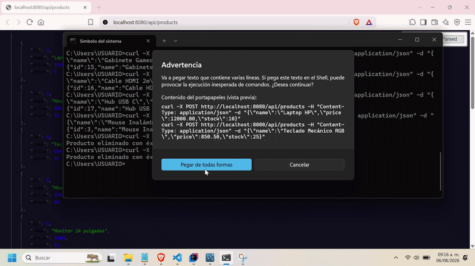

# 📦 API REST de Inventario

API REST desarrollada con **Java y Spring Boot** para administrar un inventario de productos. Implementa operaciones CRUD y persistencia en MySQL mediante Spring Data JPA.

## Funcionalidades

- Consultar todos los productos.
- Buscar un producto por su identificador.
- Registrar nuevos productos.
- Actualizar nombre, precio y existencias.
- Eliminar productos.
- Crear y actualizar automáticamente la tabla mediante JPA/Hibernate.

## Tecnologías

- Java 17
- Spring Boot
- Spring Web MVC
- Spring Data JPA
- MySQL
- Maven
- Lombok

## Modelo de producto

| Campo | Tipo | Descripción |
|---|---|---|
| `id` | Long | Identificador generado automáticamente |
| `name` | String | Nombre del producto |
| `price` | Double | Precio del producto |
| `stock` | Integer | Cantidad disponible |

## Endpoints

URL base: `http://localhost:8080/api/products`

| Método | Endpoint | Descripción |
|---|---|---|
| `GET` | `/api/products` | Obtiene todos los productos |
| `GET` | `/api/products/{id}` | Obtiene un producto por ID |
| `POST` | `/api/products` | Registra un producto |
| `PUT` | `/api/products/{id}` | Actualiza un producto |
| `DELETE` | `/api/products/{id}` | Elimina un producto |

### Ejemplo de solicitud

```json
{
  "name": "Teclado mecánico",
  "price": 1299.90,
  "stock": 15
}
```

## Ejecución local

### Requisitos

- Java 17
- MySQL
- Git
- Maven, o utilizar Maven Wrapper incluido en el proyecto

### 1. Clonar el repositorio

```bash
git clone https://github.com/nsantiagold/api-inventario-spring.git
cd api-inventario-spring/demo
```

### 2. Crear la base de datos

```sql
CREATE DATABASE inventario_db;
```

### 3. Configurar variables de entorno

La aplicación obtiene la conexión mediante las siguientes variables:

| Variable | Descripción | Valor local predeterminado |
|---|---|---|
| `DB_URL` | URL de conexión a MySQL | `jdbc:mysql://localhost:3306/inventario_db?useSSL=false&serverTimezone=UTC` |
| `DB_USER` | Usuario de MySQL | `root` |
| `DB_PASSWORD` | Contraseña de MySQL | Vacía |

No publiques contraseñas reales en `application.properties`, archivos `.env` o commits.

### 4. Ejecutar la aplicación

En Windows PowerShell:

```powershell
$env:DB_USER="root"
$env:DB_PASSWORD="TU_CONTRASENA"
.\mvnw.cmd spring-boot:run
```

En Linux o macOS:

```bash
export DB_USER=root
export DB_PASSWORD='TU_CONTRASENA'
./mvnw spring-boot:run
```

Si tu base de datos utiliza otra URL, define también `DB_URL`.

En IntelliJ IDEA, agrega `DB_URL`, `DB_USER` y `DB_PASSWORD` desde **Run → Edit Configurations → Environment variables** y ejecuta la clase `DemoApplication`.

Una vez iniciada, la API estará disponible en:

```text
http://localhost:8080/api/products
```

## Demostración



## Aprendizajes aplicados

Este proyecto permite practicar la creación de controladores REST, el mapeo de entidades con JPA, el uso de repositorios, la conexión con MySQL, la gestión segura de configuración y la organización de un proyecto Backend con Maven.
